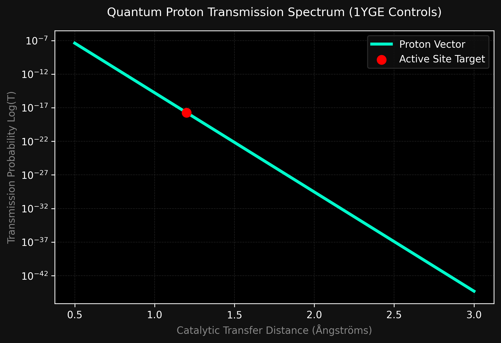

# 🧬 Quantum Enzyme Tunneling Engine & AI Mutation Platform


[](https://huggingface.co)

[](https://github.com)

[](https://huggingface.co)

---

An open-source, production-grade computational biology pipeline designed to simulate **quantum proton tunneling** across enzyme active sites and leverage **Generative AI Protein Language Models (ESM-2)** to discover kinetic acceleration mutations.

---

## 🚀 Key Project Milestones

- [x] **Phase 1:** Programmatic data collection via structural repository mirrors.
- [x] **Phase 2:** Semi-classical WKB mathematical quantum simulation engine.
- [ ] **Phase 3:** High-fidelity automated sequence mapping from 3D active sites.
- [ ] **Phase 4:** Live interactive Web UI deployment.

---

## 🛠️ System Architecture

```text
       [ RCSB PDB / EMBL-EBI Mirror ] 
                     ↓
         [ BioPython Structural Parser ]
                     ↓
     ┌───────────────┴───────────────┐
     ↓                               ↓
[ WKB Quantum Engine ]     [ Meta ESM-2 AI Engine ]
(Tunneling Probability)     (Inference Likelihoods)
     └───────────────┬───────────────┘
                     ↓
        [ Interactive WebGL Viewer ]
```
### 📊 Quantum Decay Plot Analysis


## 📊 Baseline Simulation Benchmarks

Using **Soybean Lipoxygenase-1 (PDB ID: 1YGE)** as our textbook control, the system successfully resolved the active site matrix coordinates with the following baseline execution states:

* **Catalytic Center Target:** Iron (`FE`) Core Atom
* **Active Site 3D Coordinates:** `[24.614, 44.297, 10.618]`
* **Simulated Tunneling Width:** `1.2 Å`
* **Energy Barrier Height:** `0.6 eV`
* **Proton Transmission Probability ($T$):** `1.88757e-18`

---

## 💻 Quickstart Local Environment Setup

Clone this workspace and configure the open-source dependencies directly inside a clean virtual environment:

```bash
# Clone the repository
git clone https://github.com
cd enzyme-quantum-tunneling-ai

# Install baseline computational toolkits
pip install biopython numpy scipy requests pandas torch transformers plotly
```

To run the primary baseline automated verification sequence pipeline:
```bash
python pipeline.py
```
